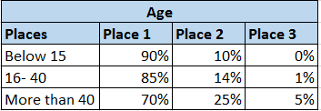
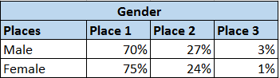
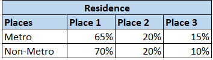
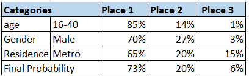

# Machine Learning with Java - Part 5 (Random Forest)

In my previous articles, we have discussed about  [Linear Regression](https://tech.io/playgrounds/3771/machine-learning-with-java---part-1-linear-regression) , [Logistic Regression](https://tech.io/playgrounds/34a7ecd0a4487577f516d92548af66891284/machine-learning-with-java---part-2-logistic-regression) , [Nearest Neighbor](https://tech.io/playgrounds/5439/machine-learning-with-java---part-3-k-nearest-neighbor),[Decision Tree](https://tech.io/playgrounds/5844/machine-learning-with-java---part-4-decision-tree) and [Naive Bayes](https://tech.io/playgrounds/6734/machine-learning-with-java---part-5-naive-bayes) .In this article, we are going to discuss about the most important classification algorithm which is Random Forest Algorithm.

# Random Forest 

Random forest is a trademark term for an ensemble classifier (learning algorithms that construct a. set of classifiers and then classify new data points by taking a (weighted) vote of their predictions) that consists of many decision trees and outputs the class that is the mode of the classes output by individual trees. Random forests are collections of trees, all slightly different.
It belongs to supervised learning.

Random Forest algorithm can be used for both the classification and regression kind of problems. You might be wondered to know "How a single algorithm can be used for both classification and regression kind of problems?". We will discuss in detail below.

# Difference with Decision Tree

In Random Forest, we are creating more number of decision trees but the construction of decision is not with information gain and Gini index approach. The process of finding the root node and splitting the features node will happen randomly.

Let us consider, you are planning to go for a trip and also decided to ask suggestions about place from your friend. Your friend will ask some questions to decide which places you will like and which are all places you may not be interested based on the details he got from you. In this case, decision tree will be used to find the place which you will like.

The above case is a decision tree, your friend used the answers given by you to predict your likes and moreover final decision is taken by a single person using the only one decision tree.

But you don’t want to ask suggestions only from your close friend. So, you decided to ask all your friends. Your friends will ask random questions to predict your likes. In this case, random forest will be used to decide the place based on the ratings which have got most. There are many friends involved and everyone has asked different questions. i.e. Many trees are involved and final decision is based on number of votes. So, it is random forest.

Hope difference between decision tree with random forest is understood from the above example.

# Why Random Forest

The few advantages of random forest algorithm are listed below,

1. It can be used for both classification and regression kind of problems.

2. It will be easier to handle missing values.

3. Overfitting (noise of the model) will be avoided by having many trees and so therefore more accurate.

4. It run efficiently on large databases

# Case Study

Let us consider we need to find people favorite places based on few factors.

In this scenario, we want to find people favorite tourist places (Places 1,2,3 are the three given places) and based on the high percentage we will decide which place people will like based on age, gender and residence. Another way to calculate this is based on number of likes instead percentage.

 <B> Age </B>
 In this based on age, we are getting the data in terms of percentage.
  
 
 <B> Gender </B>
 Gender based people votes in terms of percentage are given below
 

 <B> Residence </B>
 Residence is used as one of the factor determine people favorite spot
      
  
  <B> Final Chart </B>
  Based on the above sets, we will find the favorite spot for a guy whose age is 30 and stays in metro.
  
  The final chart describes that place 1 he likes 70 % and place 2 is 20% and 6% may be place 3.

# Random Forest Demo

@[Random Forest Demo]({"stubs": ["src/main/java/com/gg/ml/RandomForestDemo.java"], "command": "com.gg.ml.RandomForestDemoTest#test"})

# Code Explanation

In this above sample code, we have used Random Forest classifier of Weka. We can also set the number of trees. Please don’t take the data considered here for executing the class files. Because we can predict learn more with large data sets only.

Note: Example case study data and demo file data are different.In my upcoming artciles, I will explain about information gain and gini index in detail.

